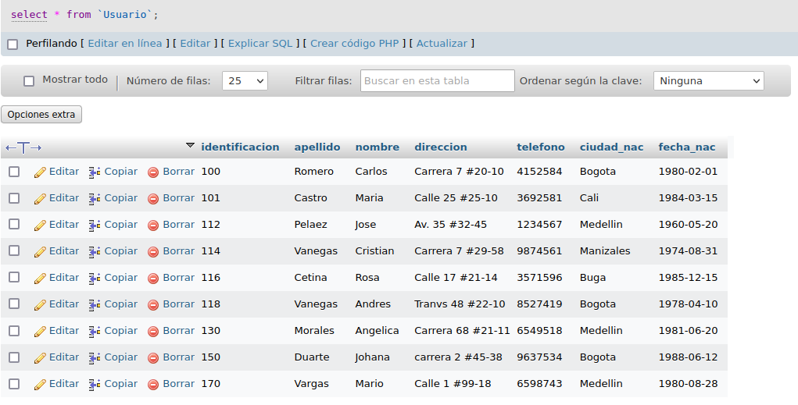
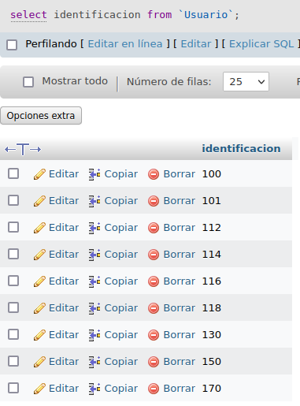
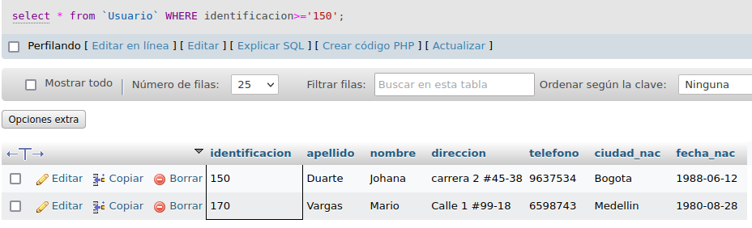
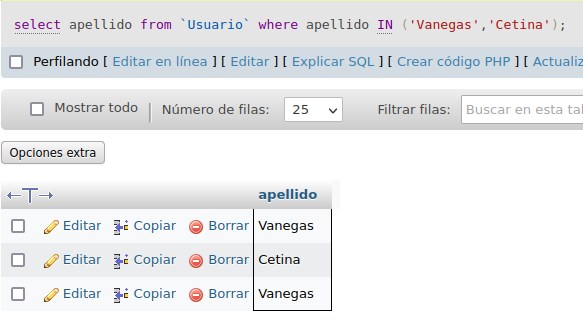
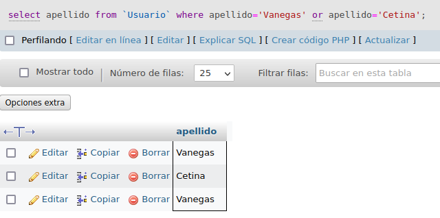
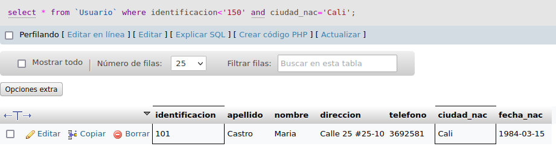

# Consultas1-SQL

#CONSULTA SQL

## Tabla usuario

1. Para visualizar toda la información que contiene la tabla `usuario` se puede incluir con la instrucción SELECT el carcter '*' o cada uno de los campos de la tabla 

`select * from usuario`

2. Visualzar solamente la identificación del usuario

`select identificación from usuario`

3. si se desea obtener ls registros cuya identificación sean mayores o iguales a 150; se debe utilizar la clausula WHERE que especifica las condiciones que deben los registros que se van a seleccionar.

`SELECT * FROM Usuario WHERE Identificacion>=150`

4.Si se desea obtener los rgistros cuyo sus apellidos sean Vanegas o Cetina, se debe utilizar el operador IN que especifica los registros que se quieren visualizar en la tabla

`select apellidos from Usuario where apellidos IN('Vanegas', 'Cetina')`

O se puede utilizar el operador OR

`select apellido from Usuario where apellido='Vanegas' or apellido='Cetina'`

5. Si se desea obtener los registros cuya identificación sea menor a 110 y la ciudad sea Cali se debe utilizar el operador AND.

`select * from Usuario where identificacion<'150' and ciudad_nac='Cali'`

