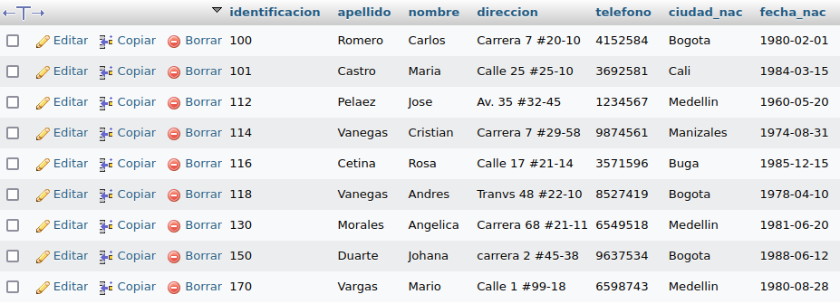

# Consultas1-SQL

#CONSULTA SQL

## Tabla usuario

1. Para visualizar toda la información que contiene la tabla `usuario` se puede incluir con la instrucción SELECT el carcter '*' o cada uno de los campos de la tabla 

`select * from usuario`

2. Visualzar solamente la identificación del usuario

`select identificación from usuario`

3. si se desea obtener ls registros cuya identificación sean mayores o iguales a 150; se debe utilizar la clausula WHERE que especifica las condiciones que deben los registros que se van a seleccionar.

`SELECT * FROM Usuario WHERE Identificacion>=150`

